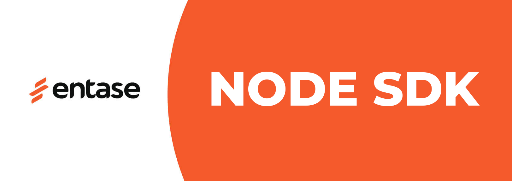

# Entase Node.js SDK

Node.js Development Kit for Entase API.



## Requirements
- Node.js >= 14.0.0
- ES Modules support

## Installation

```bash
npm install @entaseteam/sdk.node
```

## Usage

```javascript
import { Client, Env } from '@entaseteam/sdk.node';

// Optional: Enable debug mode
Env.setDebugMode(true);

// Optional: Change API URL (for development)
// Env.APIURL = 'https://api.ensdev.net/v2/';

// Initialize the client
const client = new Client('your-api-key');

// Example: Get productions
try {
    const productions = await client.productions.getAll({
        limit: 10,
        sort: { id: 'asc' },
        extend: ['ownerName']
    });
    
    for (const production of productions) {
        console.log(production.title);
    }

    // Get next page if available
    if (productions._cursor?.hasMore) {
        const nextPage = await productions.next();
        // ... handle next page
    }
} catch (error) {
    console.error('Error:', error.message);
}
```

## API Endpoints

### Productions
```javascript
// Get all productions
const productions = await client.productions.getAll({
    limit: 10,                    // Optional: 1-100, default 30
    sort: { id: 'asc' },         // Optional: asc or desc, default desc
    extend: ['ownerName'],       // Optional: additional fields
    after: 'production-id'       // Optional: for pagination
});

// Get specific production
const production = await client.productions.getById('production-id');
```

### Events
```javascript
// Get all events
const events = await client.events.getAll({
    limit: 10,                    // Optional: 1-100, default 30
    sort: { id: 'asc' },         // Optional: asc or desc, default desc
    extend: ['productionTitle'],  // Optional: productionTitle, productionStory, pricelist
    filter: {                     // Optional: filter by properties
        status: [1, 2],           // Status values: 0-5
        productionID: 'prod-id'   // Filter by production
    }
});

// Get specific event
const event = await client.events.getById('event-id');
```

### Photos
```javascript
// Get photos for an object (e.g., Production, Event)
const photos = await client.photos.getByObject('Production:production-id', {
    serve: ['300x300']  // Optional: request specific sizes
});

// Note: getAll() and getById() are not supported for Photos
```

### Partners
```javascript
// Get current partner info
const partner = await client.partners.me();

// Get specific partner
const partner = await client.partners.getById('partner-id');

// Note: getAll() is not supported for Partners
```

### Booking Orders
```javascript
// Get all orders
const orders = await client.bookingOrders.getAll({
    limit: 10,
    sort: { id: 'asc' }
});

// Get order by ID
const order = await client.bookingOrders.getById('order-id');

// Get order by code
const order = await client.bookingOrders.getByCode('AAA-BBB-CCC');

// Get all tickets for an order
const tickets = await client.bookingOrders.getAllTicketsByOrder('order-id');

// Get specific ticket from an order
const ticket = await client.bookingOrders.getTicketByOrder('order-id', 'ticket-id');
```

## Error Handling

The SDK provides two types of errors:
- `RequestError`: For HTTP-related errors
- `APIError`: For API-specific errors

```javascript
try {
    const productions = await client.productions.getAll();
} catch (error) {
    if (error instanceof RequestError) {
        console.error('HTTP Error:', error.message, 'Status:', error.statusCode);
    } else if (error instanceof APIError) {
        console.error('API Error:', error.message, 'Status:', error.statusCode);
    } else {
        console.error('Network Error:', error.message);
    }
}
```

## Pagination

All collection responses support cursor-based pagination:

```javascript
const productions = await client.productions.getAll({ limit: 10 });

// Check if there are more items
if (productions._cursor?.hasMore) {
    // Get next page
    const nextPage = await productions.next();
}
```

## Debug Mode

Enable debug mode to see API requests and responses:

```javascript
Env.setDebugMode(true);
```

## License

MIT License 